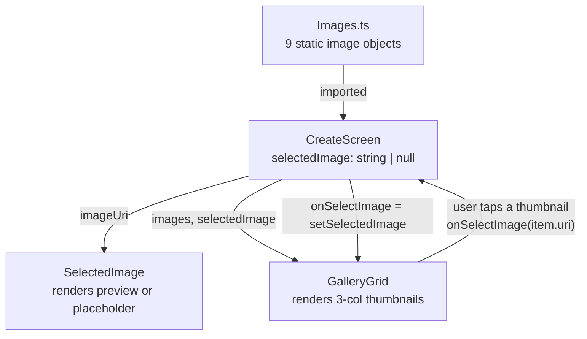
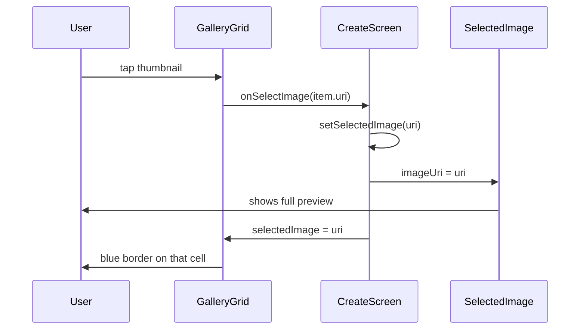

# Create Screen — Flow Documentation

How the "New post" screen works today: which files are involved, how state moves between them, and what is still unfinished.

---

## 1. Files involved

| File | Role |
|---|---|
| [CreateScreen.tsx](../src/screens/CreateScreen.tsx) | Screen container. Owns the only piece of state (`selectedImage`). |
| [CreateHeader.tsx](../src/components/Create_Screen_Components/CreateHeader.tsx) | Top bar: close (X), title "New post", "Next" action. |
| [SelectedImage.tsx](../src/components/Create_Screen_Components/SelectedImage.tsx) | Square preview area for the currently chosen image. |
| [GridGallary.tsx](../src/components/Create_Screen_Components/GridGallary.tsx) | 3-column gallery of thumbnails to pick from. |
| [Images.ts](../src/data/Images.ts) | Hard-coded list of 9 demo images (`picsum.photos` URLs). |
| [Authstack.tsx](../src/navigations/Authstack.tsx) | Registers the route under the name `CreateScreen`. |
| [Bottom.tsx](../src/navigations/Bottom.tsx) | The `+` button in the Home header that pushes to `CreateScreen`. |

---

## 2. How the user gets here

The screen is reached from the **`+` icon in the Home tab header**, not from the bottom tab bar:

```
Home tab header  →  <Plus/> pressed  →  navigation.push('CreateScreen')
```

Defined at [Bottom.tsx:54](../src/navigations/Bottom.tsx#L54), and the route itself at [Authstack.tsx:74-75](../src/navigations/Authstack.tsx#L74-L75).

> **Note:** the bottom tab literally named `Create` renders `MessageScreen`, not this screen ([Bottom.tsx:98-105](../src/navigations/Bottom.tsx#L98-L105)). That is a wiring mismatch, not a second entry point.

---

## 3. Component tree

```
SafeAreaView                     (black background, flex: 1)
└── View
    ├── CreateHeader             ← X · "New post" · Next
    ├── SelectedImage            ← square preview (width × width)
    └── GalleryGrid              ← FlatList, 3 columns
```

Rendered in [CreateScreen.tsx:13-19](../src/screens/CreateScreen.tsx#L13-L19).

---

## 4. State flow

There is exactly **one** state value on this screen:

```tsx
const [selectedImage, setSelectedImage] = useState<string | null>(null);
```

It holds the **URI string** of the picked image (not the id, not the object), and `null` means nothing is picked yet.



**Downward (props):**
- `selectedImage` → `SelectedImage` as `imageUri`, used to decide preview vs. placeholder.
- `selectedImage` → `GalleryGrid`, used to draw the blue border on the active thumbnail.
- `setSelectedImage` → `GalleryGrid` as `onSelectImage`.

**Upward (callback):**
- Tapping a thumbnail calls `onSelectImage(item.uri)` ([GridGallary.tsx:37](../src/components/Create_Screen_Components/GridGallary.tsx#L37)), which *is* `setSelectedImage`, so the screen re-renders and both children update from the same value.

---

## 5. Step-by-step runtime flow

1. **Mount** — `CreateScreen` renders with `selectedImage = null`.
2. **Header** paints immediately; it has no dependency on the selection.
3. **Preview** — `SelectedImage` sees `imageUri === null` and renders the placeholder `"No Image Selected"` on a `#111` square ([SelectedImage.tsx:24-28](../src/components/Create_Screen_Components/SelectedImage.tsx#L24-L28)).
4. **Gallery** — `GalleryGrid` maps the 9 entries from `Images.ts` into a `FlatList` with `numColumns={3}`; each cell is `width / 3` square.
5. **User taps a thumbnail** → `onSelectImage(item.uri)` → `setSelectedImage(uri)`.
6. **Re-render:**
   - `SelectedImage` now takes the truthy branch and renders the full-bleed `<Image resizeMode="cover" />`.
   - `GalleryGrid` compares `selectedImage === item.uri` and applies `styles.selectedImage` — a 3px `#0095F6` border — to the matching cell.
7. **Tapping another thumbnail** simply overwrites the URI. Selection is single-image and cannot be cleared from the UI.
8. **X button** → `navigation.goBack()`. The screen unmounts and the selection is discarded (no persistence).
9. **Next button** → currently a no-op (see below).



---

## 6. Layout / sizing rules

- `IMAGE_SIZE = Dimensions.get("window").width / 3` — gallery cells ([GridGallary.tsx:21-22](../src/components/Create_Screen_Components/GridGallary.tsx#L21-L22)).
- Preview container is `width × width` — a perfect square ([SelectedImage.tsx:37-41](../src/components/Create_Screen_Components/SelectedImage.tsx#L37-L41)).
- Header is a fixed `55` tall row, `space-between`.
- Both sizes are computed once at module load, so they do **not** respond to rotation.

---

## 7. What is not implemented yet

| Gap | Where |
|---|---|
| **"Next" does nothing** — no `onPress`, so the user cannot advance to a caption/publish step. | [CreateHeader.tsx:28-32](../src/components/Create_Screen_Components/CreateHeader.tsx#L28-L32) |
| **No real gallery access** — images are 9 hard-coded remote URLs, not the device camera roll. | [Images.ts](../src/data/Images.ts) |
| **No multi-select** — state is a single string, so only one image at a time. | [CreateScreen.tsx:10](../src/screens/CreateScreen.tsx#L10) |
| **No deselect** — tapping the selected image again re-selects it rather than clearing. | [GridGallary.tsx:37](../src/components/Create_Screen_Components/GridGallary.tsx#L37) |
| **No camera / crop / filter step.** | — |
| **Selection is lost on back**, nothing is persisted or uploaded. | — |
| **Bottom "Create" tab points at `MessageScreen`.** | [Bottom.tsx:98-105](../src/navigations/Bottom.tsx#L98-L105) |

---

## 8. Natural next steps

If the flow is extended, the shape suggests:

1. Wire `Next` → navigate to a `NewPostDetails` screen, passing `selectedImage` as a route param.
2. Replace `Images.ts` with a real picker (`expo-media-library` / `react-native-image-picker`) behind the same `GalleryImage[]` shape, so `GalleryGrid` needs no change.
3. For multi-select, change state to `string[]` and update the two comparisons (`imageUri` in the preview, `===` in the grid) — the prop contract stays otherwise identical.
